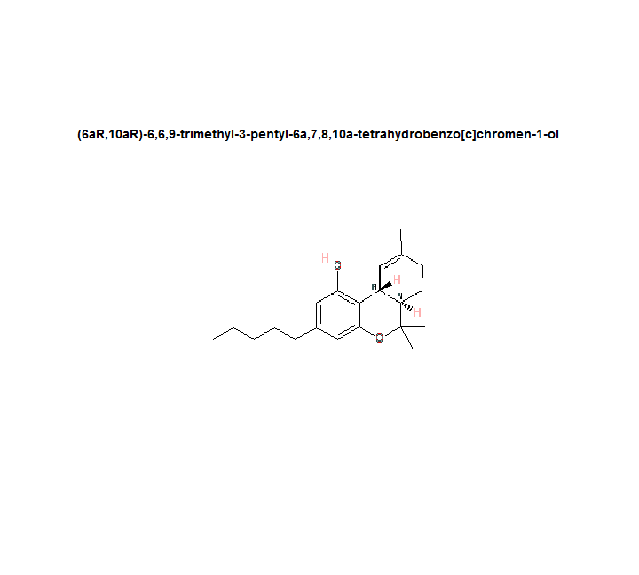

CIRgetR
=======

R interface for chemical identifier translation through the [Chemical Identifier Resolver (CIR)](http://cactus.nci.nih.gov/chemical/structure) by the CADD Group at the NCI/NIH.

Install package.
```r
install.packages("devtools");install.packages("RJSONIO")
library(devtools);library(RJSONIO)

install_github(repo = "CIRgetR", username = "dgrapov")
library(CIRgetR)

#to show gif
install.packages("caTools")
```


Try translating inchi codes.

```r
# test
id <- "CYQFCXCEBYINGO-IAGOWNOFSA-N"
opts <- c("smiles", "names", "iupac_name", "cas", "inchi", "stdinchi", "inchikey", 
    "stdinchikey", "ficts", "ficus", "uuuuu", "image", "file", "mw", "monoisotopic_mass", 
    "chemspider_id", "pubchem_sid", "chemnavigator_sid", "formula", "chemnavigator_sid")

translations <- lapply(1:length(opts), function(i) {
    CIRgetR(id = id, to = opts[i], return.all = FALSE, progress = FALSE)
})
translations <- do.call("cbind", translations)
t(translations)
```

```
##                   [,1]                                                                                                                                  
## smiles            "[C@H]23C1=C(C=C(C=C1OC([C@@H]2CCC(=C3)C)(C)C)CCCCC)O"                                                                                
## names             "(6aR,10aR)-6,6,9-trimethyl-3-pentyl-6a,7,8,10a-tetrahydrobenzo[c]chromen-1-ol"                                                       
## iupac_name        "(6aR,10aR)-6,6,9-trimethyl-3-pentyl-6a,7,8,10a-tetrahydrobenzo[c]chromen-1-ol"                                                       
## cas               "5957-27-7"                                                                                                                           
## inchi             "InChI=1/C21H30O2/c1-5-6-7-8-15-12-18(22)20-16-11-14(2)9-10-17(16)21(3,4)23-19(20)13-15/h11-13,16-17,22H,5-10H2,1-4H3/t16-,17-/m1/s1" 
## stdinchi          "InChI=1S/C21H30O2/c1-5-6-7-8-15-12-18(22)20-16-11-14(2)9-10-17(16)21(3,4)23-19(20)13-15/h11-13,16-17,22H,5-10H2,1-4H3/t16-,17-/m1/s1"
## inchikey          "InChIKey=CYQFCXCEBYINGO-IAGOWNOFNA-N"                                                                                                
## stdinchikey       "InChIKey=CYQFCXCEBYINGO-IAGOWNOFSA-N"                                                                                                
## ficts             "D6DB420FE104B075-FICTS-01-3A"                                                                                                        
## ficus             "D6DB420FE104B075-FICuS-01-5B"                                                                                                        
## uuuuu             "03D2FB2779F109C1-uuuuu-01-04"                                                                                                        
## image             "http://cactus.nci.nih.gov/chemical/structure/CYQFCXCEBYINGO-IAGOWNOFSA-N/image"                                                      
## file              "C21H30O2"                                                                                                                            
## mw                "314.4668"                                                                                                                            
## monoisotopic_mass "314.2246"                                                                                                                            
## chemspider_id     "15266"                                                                                                                               
## pubchem_sid       "24701569"                                                                                                                            
## chemnavigator_sid "28846069"                                                                                                                            
## formula           "C21H30O2"                                                                                                                            
## chemnavigator_sid "28846069"
```


Show structures.

```r
library(caTools)
image.url <- as.character(translations$image[1])
gif <- read.gif(image.url, verbose = TRUE, flip = TRUE)
```

```
## GIF image header
## Global colormap with 32 colors 
## Comment Extension
## Image [250 x 250]: 1114 bytes
```

```r
par(pin = c(3.5, 3.5))
image(gif$image, col = gif$col, main = as.character(translations$name[1]), frame.plot = FALSE, 
    xaxt = "n", yaxt = "n")
```

 

